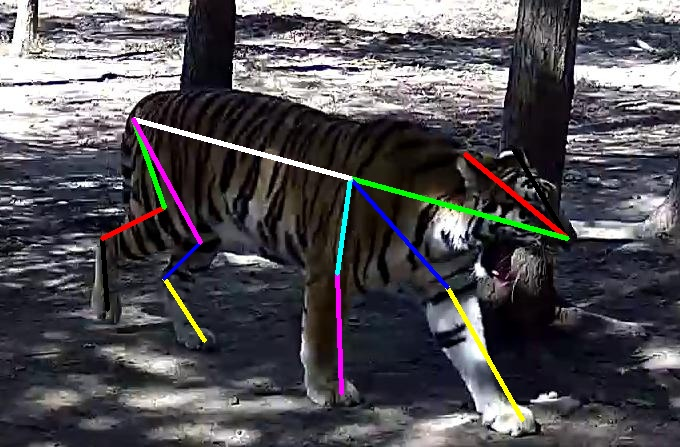
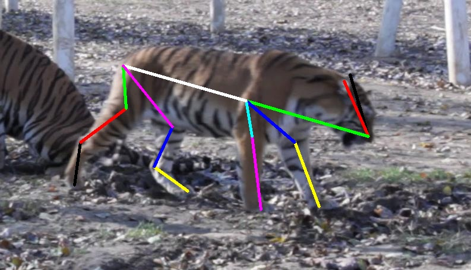
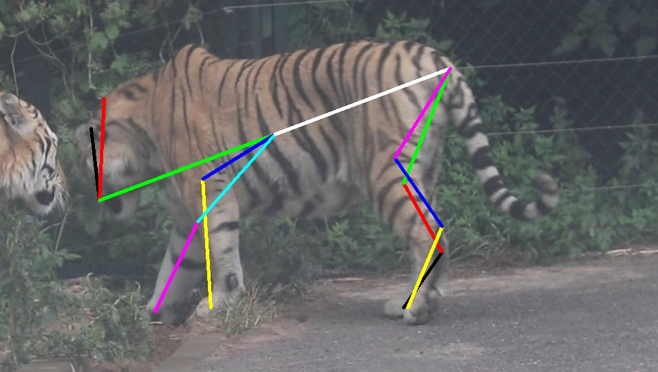
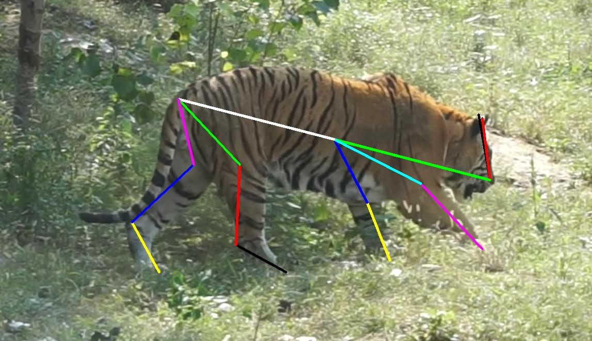

# CVWC2019-pose

## Introduction
Using HRNet for [CVWC 2019 Tiger Pose Track Challenge](https://cvwc2019.github.io/challenge.html) based on https://github.com/leoxiaobin/deep-high-resolution-net.pytorch. For the keypoints difference between human and tiger, we made some modifications in the original [cocoapi](https://github.com/cocodataset/cocoapi).

## Environment
The code is developed using python 3.6.6 on Ubuntu 16.04. NVIDIA GPUs are needed. The code is developed and tested using 1 Tesla V100 GPU cards. Other platforms or GPU cards are not fully tested, and you need pay attention to the modification of the parameters in cfg file, like LR, END_EPOCH, BATCH_SIZE_PER_GPU and etc. You can refer to [the scheduling rules from Detectron](https://github.com/facebookresearch/Detectron/blob/master/configs/getting_started/tutorial_1gpu_e2e_faster_rcnn_R-50-FPN.yaml#L14-L30).

## Installation
1. Install pytorch >= v1.0.0 following [official instruction](https://pytorch.org/).
   **Note that if you use pytorch's version < v1.0.0, you should following the instruction at <https://github.com/Microsoft/human-pose-estimation.pytorch> to disable cudnn's implementations of BatchNorm layer. We encourage you to use higher pytorch's version(>=v1.0.0)**
2. Clone this repo, and we'll call the directory './CVWC2019-pose/deep-high-resolution-net.pytorch' you cloned as ${POSE_ROOT}. And './CVWC2019-pose/cocoapi' as ${COCOAPI}.
3. Install dependencies under {POSE_ROOT}:
   ```
   pip install -r requirements.txt
   ```
4. Make libs:
   ```
   cd ${POSE_ROOT}/lib
   make
   ```
5. Install modified cocoapi:
   ```
   cd ${COCOAPI}/PythonAPI
   # Install into global site-packages
   make install
   # Alternatively, if you do not have permissions or prefer
   # not to install the COCO API into global site-packages
   python3 setup.py install --user
   ```
6. Init output(training model output directory) and log(tensorboard log directory) directory under ${POSE_ROOT}:

   ```
   mkdir output 
   mkdir log
   ```
   
    Your directory tree should looks like this:

   ```
   ${POSE_ROOT}
   ├── data
   ├── experiments
   ├── lib
   ├── log
   ├── models
   ├── output
   ├── tools 
   ├── train.sh
   ├── test.sh
   └── requirements.txt
   ```
   
7. Download pretrained models from HRNet model zoo([GoogleDrive](https://drive.google.com/drive/folders/1hOTihvbyIxsm5ygDpbUuJ7O_tzv4oXjC?usp=sharing) or [OneDrive](https://1drv.ms/f/s!AhIXJn_J-blW231MH2krnmLq5kkQ))
   ```
   ${POSE_ROOT}
    `-- models
        `-- pytorch
            |-- imagenet
            |   |-- hrnet_w48-8ef0771d.pth

   ```
   
## Data Preparation
For CVWC 2019 Tiger Pose Track data, you should make them like this:
```
${POSE_ROOT}
|-- data
`-- |-- atrw
    `-- |-- pose
        `-- |-- annotations
            |   |-- image_info_test.json
            |   |-- keypoints_train.json
            |   |-- keypoints_trainval.json
            |   |-- keypoints_val.json
            `-- images
                `-- test
                |   |-- 000000.jpg
                |   |-- 000004.jpg
                `-- train
                    |-- 000002.jpg
                    |-- 000003.jpg
                    |-- ... 
                `-- val
                    |-- 000001.jpg
                    |-- 000013.jpg
                    |-- ... 
                `-- trainval
                    |-- 000001.jpg
                    |-- 000002.jpg
                    |-- ...
```
You can directly download the json files from dir 'data/atrw/pose/annotations'.

## Training and Testing
Please pay attention to modify the parameter of DATASET in cfg file for training or testing.
#### Train on tiger dataset using pretrained model:

```
bash train.sh
```

#### Test with our best model:

```
bash test.sh
```

## Results






## Citation
Thanks for MSRA's [wonderful work](https://github.com/leoxiaobin/deep-high-resolution-net.pytorch)

```
@inproceedings{sun2019deep,
  title={Deep High-Resolution Representation Learning for Human Pose Estimation},
  author={Sun, Ke and Xiao, Bin and Liu, Dong and Wang, Jingdong},
  booktitle={CVPR},
  year={2019}
}

@inproceedings{xiao2018simple,
    author={Xiao, Bin and Wu, Haiping and Wei, Yichen},
    title={Simple Baselines for Human Pose Estimation and Tracking},
    booktitle = {European Conference on Computer Vision (ECCV)},
    year = {2018}
}
```
